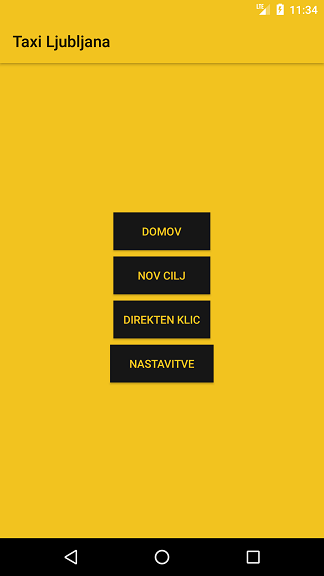
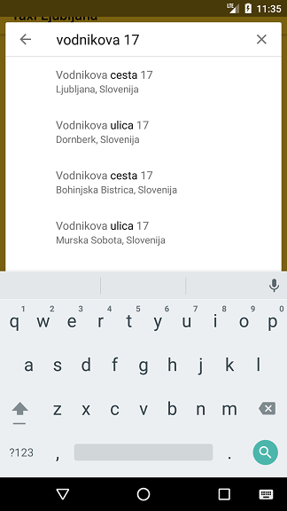
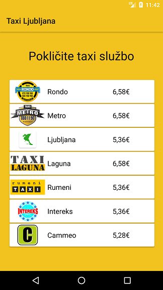

# Taxi Ljubljana

This is an Android app meant for citizens of Ljubljana that get around with taxi services. The user enters their destination, and the app informs them how much the ride will cost with each of Ljubljana's major taxi companies.

## Showcase screenshots

## Getting Started

1. Clone or download the project from this page.
2. Import the project into Android Studio.

## Authors

* **Matic Pajnič** 
